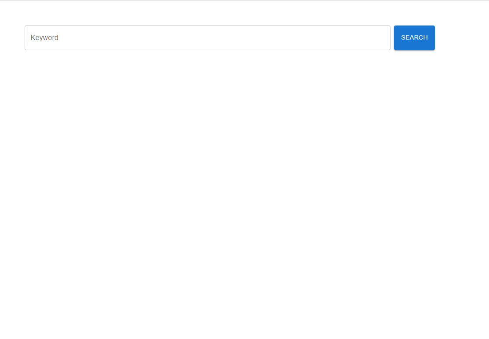
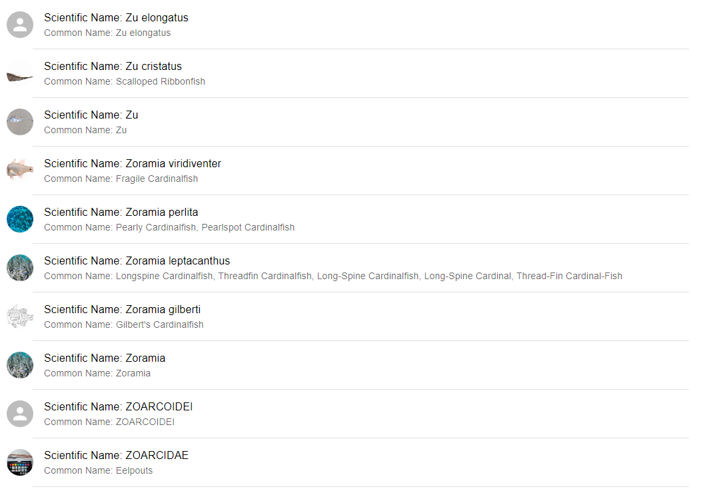
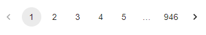
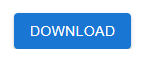

# Getting Started with Species Searching Engine

This project was bootstrapped with React.

## Steps to run this project

In the project directory, you can run:

### Step 1: `npm install`

Before running this project, install all the essentail dependencies this project used.

### Step 2: `npm start`

Runs the app in the development mode.\
Open [http://localhost:3000](http://localhost:3000) to view it in the browser.

The page will reload if you make edits.\
You will also see any lint errors in the console.

## How to test this project

The initial page should be like below:

The text field will accept input as keyword, once search button is hit, a list of relavant result will be displayed.

Each page will show 10 results by default, use Pagination at the bottom to switch between pages:

A Download button at the top of the list will allow a user to download the first 100 records of the results in a CSV file:\

